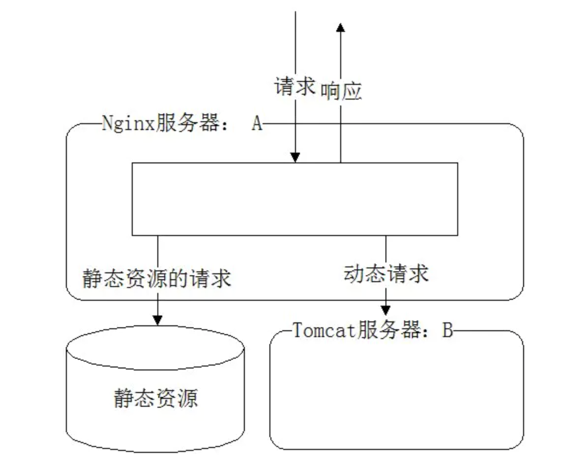
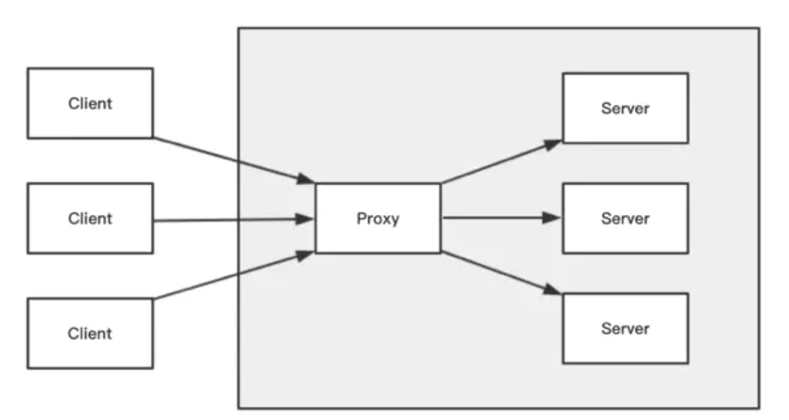

# Nginx 快速入门

## 何为Nginx

Nginx 是一款轻量级的 HTTP 服务器，采用事件驱动的异步非阻塞处理方式框架，这让其具有极好的 IO 性能，时常用于服务端的反向代理和负载均衡。Nginx 是什么，总结一下就是这些：

* 一种轻量级的web服务器

* 设计思想是事件驱动的异步非阻塞处理【select、poll、epoll】

* 占用内存少、启动速度快、并发能力强

* 使用C语言开发

* 扩展性好，第三方插件非常多,在互联网项目中广泛应用

## nginx 安装【mac环境】

```
brew install nginx

启动 Nginx：
sudo nginx 或 sudo brew services start nginx
停止 Nginx：
sudo nginx -s stop 或 sudo brew services stop nginx
热重启 Nginx：
sudo nginx -s reload
强制停止 Nginx：
sudo pkill -9 nginx
```

## nginx 配置

修改配置，经常要用到的几个文件路径：
```
/usr/local/etc/nginx/nginx.conf （nginx配置文件路径）
/usr/local/var/www （nginx服务器默认的根目录）
/usr/local/Cellar/nginx/1.17.9 （nginx的安装路径）
/usr/local/var/log/nginx/error.log (nginx默认的日志路径)
```


```
# 首尾配置暂时忽略
server {  
        # 当nginx接到请求后，会匹配其配置中的service模块
        # 匹配方法就是将请求携带的host和port去跟配置中的server_name和listen相匹配
        listen       8080;        
        server_name  localhost; # 定义当前虚拟主机（站点）匹配请求的主机名

        location / {
            root   html; # Nginx默认值
            # 设定Nginx服务器返回的文档名
            index  index.html index.htm; # 先找根目录下的index.html，如果没有再找index.htm
        }
}
```

server{ } 其实是包含在 http{ } 内部的。每一个 server{ } 是一个虚拟主机（站点）。
上面代码块的意思是：当一个请求叫做localhost:8080请求nginx服务器时，该请求就会被匹配进该代码块的 server{ } 中执行。

## Nginx主要应用



* 动静分离

如图所示，动静分离其实就是 Nginx 服务器将接收到的请求分为动态请求和静态请求。
静态请求直接从 nginx 服务器所设定的根目录路径去取对应的资源，动态请求转发给真实的后台（前面所说的应用服务器，如图中的Tomcat）去处理。这样做不仅能给应用服务器减轻压力，将后台api接口服务化，还能将前后端代码分开并行开发和部署。

```
server {  
        listen       8080;        
        server_name  localhost;

        location / {
            root   html; # Nginx默认值
            index  index.html index.htm;
        }
        
        # 静态化配置，所有静态请求都转发给 nginx 处理，存放目录为 my-project
        location ~ .*\.(html|htm|gif|jpg|jpeg|bmp|png|ico|js|css)$ {
            root /usr/local/var/www/my-project; # 静态请求所代理到的根目录
        }
        
        # 动态请求匹配到path为'node'的就转发到8002端口处理
        location /node/ {  
            proxy_pass http://localhost:8002; # 充当服务代理
        }
}
```

* 反向代理

反向代理其实就类似你去找代购帮你买东西（浏览器或其他终端向nginx请求），你不用管他去哪里买，只要他帮你买到你想要的东西就行（浏览器或其他终端最终拿到了他想要的内容，但是具体从哪儿拿到的这个过程它并不知道）。

```
正向代理，代理的是用户。
反向代理，代理的是服务器
```

反向代理的作用
1. 保障应用服务器的安全（增加一层代理，可以屏蔽危险攻击，更方便的控制权限）
2. 实现负载均衡（稍等~下面会讲）
3. 实现跨域（号称是最简单的跨域方式）

```
server {  
        listen       8080;        
        server_name  localhost;

        location / {
            root   html; # Nginx默认值
            index  index.html index.htm;
        }
        proxy_pass http://localhost:8000; # 反向代理配置，请求会被转发到8000端口
}
```



nginx 就是充当图中的 proxy。左边的3个 client 在请求时向 nginx 获取内容，是感受不到3台 server 存在的。此时，proxy就充当了3个 server 的反向代理。反向代理应用十分广泛，CDN 服务就是反向代理经典的应用场景之一。除此之外，反向代理也是实现负载均衡的基础，很多大公司的架构都应用到了反向代理。

##负载均衡
随着业务的不断增长和用户的不断增多，一台服务已经满足不了系统要求了。这个时候就出现了服务器 集群。
在服务器集群中，Nginx 可以将接收到的客户端请求“均匀地”（严格讲并不一定均匀，可以通过设置权重）分配到这个集群中所有的服务器上。这个就叫做负载均衡。

负载均衡的作用:分摊服务器集群压力、保证客户端访问的稳定性

Note:前面也提到了，负载均衡可以解决分摊服务器集群压力的问题。除此之外，Nginx还带有健康检查（服务器心跳检查）功能，会定期轮询向集群里的所有服务器发送健康检查请求，来检查集群中是否有服务器处于异常状态。
一旦发现某台服务器异常，那么在这以后代理进来的客户端请求都不会被发送到该服务器上（直健康检查发现该服务器已恢复正常），从而保证客户端访问的稳定性。

```
upstream domain {
    server localhost:8000;
    server localhost:8001;
}
server {  
        listen       8080;        
        server_name  localhost;

        location / {
            # root   html; # Nginx默认值
            # index  index.html index.htm;
            
            proxy_pass http://domain; # 负载均衡配置，请求会被平均分配到8000和8001端口
            proxy_set_header Host $host:$server_port;
        }
}
```


##正向代理
正向代理跟反向道理正好相反。拿上文中的那个代购例子来讲，多个人找代购购买同一个商品，代购找到买这个的店后一次性给买了。这个过程中，该店主是不知道代购是帮别代买买东西的。那么代购对于多个想买商品的顾客来讲，他就充当了正向代理。
正向代理的示意图如下：

nginx 就是充当图中的 proxy。左边的3个 client 在请求时向 nginx 获取内容，server 是感受不到3台 client 存在的。


正向代理，意思是一个位于客户端和原始服务器(origin server)之间的服务器，为了从原始服务器取得内容，客户端向代理发送一个请求并指定目标(原始服务器)，然后代理向原始服务器转交请求并将获得的内容返回给客户端。客户端才能使用正向代理。当你需要把你的服务器作为代理服务器的时候，可以用Nginx来实现正向代理。科学上网vpn（俗称翻墙）其实就是一个正向代理工具。


## 总结

```
正向代理，代理的是用户。【代理可以理解为代表】
反向代理，代理的是服务器
```


## 相关链接

https://juejin.im/post/5e982d4b51882573b0474c07#heading-16

https://www.nginx.cn/doc/
