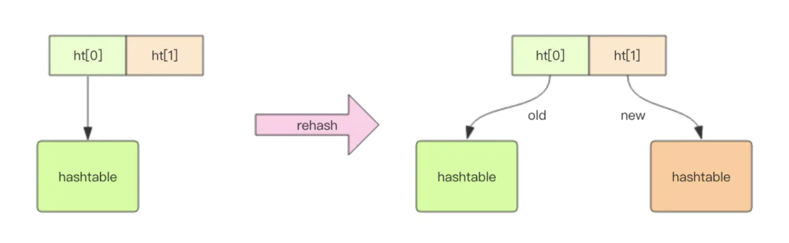
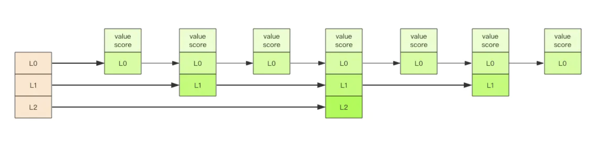

## 数据结构

* string(字符串)：Redis 的字符串是动态字符串，是可以修改的字符串，内部结构实现上类似于 Java 的 ArrayList，采用预分配冗余空间的方式来减少内存的频繁分配。当字符串长度小于 1M 时，扩容都是加倍现有的空间，如果超过 1M，扩容时一次只会多扩 1M 的空间。需要注意的是字符串最大长度为512M。


* list (列表)：Redis 的列表相当于 Java 语言里面的 LinkedList，注意它是链表而不是数组。Redis 的列表相当于 Java 语言里面的 LinkedList，注意它是链表而不是数组。
```
常见使用:
    右边进左边出：队列
    右边进右边出：栈
    慢操作：lindex、ltrim【在这个区间内的值，ltrim 要保留，区间之外统统砍掉】
    阻塞读:在队列没有数据的时候，会立即进入休眠状态，一旦数据到来，则立刻醒过来。消息的延迟几乎为零。用blpop/brpop替代前面的lpop/rpop
底层实现 ziplist 与 quicklist:
    Redis 底层存储的还不是一个简单的 linkedlist，而是称之为快速链表 quicklist 的一个结构。
    首先在列表元素较少的情况下会使用一块连续的内存存储，这个结构是 ziplist，也即是压缩列表。
    它将所有的元素紧挨着一起存储，分配的是一块连续的内存。当数据量比较多的时候才会改成 quicklist。
    quickList 是 zipList 和 linkedList 的混合体，它将 linkedList 按段切分，每一段使用 zipList 来紧凑存储，多个 zipList 之间使用双向指针串接起来。
```
将链表和 ziplist 结合起来组成了 quicklist。也就是将多个 ziplist 使用双向指针串起来使用。这样既满足了快速的插入删除性能，又不会出现太大的空间冗余。


* hash (字典)：Redis 的字典相当于 Java 语言里面的 HashMap，它是无序字典。内部实现结构上同 Java 的 HashMap 也是一致的，同样的数组 + 链表二维结构。当哈希表较小时使用ziplist存储。另外它们 rehash 的方式不一样，因为 Java 的 HashMap 在字典很大时，rehash 是个耗时的操作，需要一次性全部 rehash。Redis 为了高性能，不能堵塞服务，所以采用了渐进式 rehash 策略。
    * 渐进式 rehash 会在 rehash 的同时，保留新旧两个 hash 结构，查询时会同时查询两个 hash 结构，然后在后续的定时任务中以及 hash 操作指令中，循序渐进地将旧 hash 的内容一点点迁移到新的 hash 结构中。当搬迁完成了，就会使用新的hash结构取而代之。
    * 当hash 移除了最后一个元素之后，该数据结构自动被删除，内存被回收。
    

```
hash 也有缺点，hash 结构的存储消耗要高于单个字符串，到底该使用 hash 还是字符串，需要根据实际情况再三权衡。
```

* set (集合)：Redis 的集合相当于 Java 语言里面的 HashSet，它内部的键值对是无序的唯一的。它的内部实现相当于一个特殊的字典，字典中所有的 value 都是一个值NULL。当集合中最后一个元素移除之后，数据结构自动删除，内存被回收。

* zset (有序集合)：zset 可能是 Redis 提供的最为特色的数据结构，它也是在面试中面试官最爱问的数据结构。它类似于 Java 的 SortedSet 和 HashMap 的结合体，一方面它是一个 set，保证了内部 value 的唯一性，另一方面它可以给每个 value 赋予一个 score，代表这个 value 的排序权重。它的内部实现用的是一种叫做「跳跃列表」的数据结构。
```
ZADD key score1 member1 score可以重复，member不能重复
主要用于排序相关场景
```



跳跃列表采取一个随机策略来决定新元素可以兼职到第几层，首先 L0 层肯定是 100% 了，L1 层只有 50% 的概率，L2 层只有 25% 的概率，L3 层只有 12.5% 的概率，一直随机到最顶层 L31 层。绝大多数元素都过不了几层，只有极少数元素可以深入到顶层。

## 通用原则

容器型数据结构的通用规则list/set/hash/zset 这四种数据结构是容器型数据结构，它们共享下面两条通用规则：
```
create if not exists
drop if no elements
```
