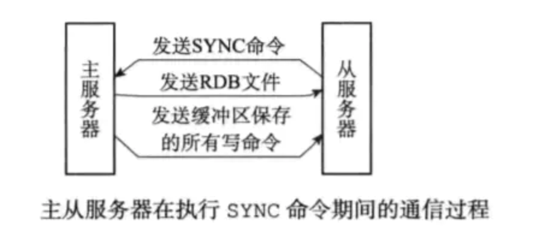
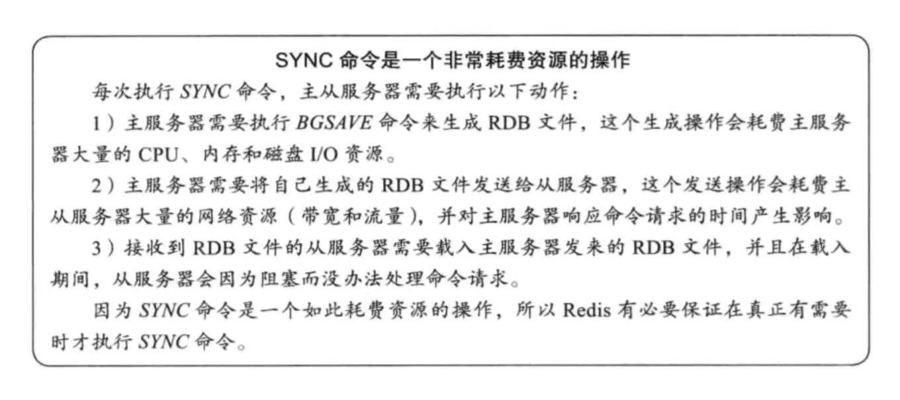
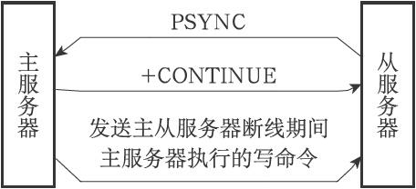
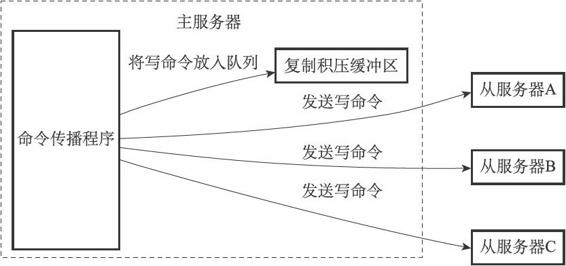

## 主从同步

当有多台 Redis 服务器时，肯定就有一台主服务器和多台从服务器。一般来说，主服务器进行写操作，从服务器进行读操作。这时候从服务器需要和主服务器进行数据同步。假如，现在有 2 台 Redis 服务器，地址分别是 127.0.0.1:6379 和 127.0.0.1:12345
我们在 127.0.0.1:12345 的客户端输入命令：
```
127.0.0.1:12345> SLAVEOF 127.0.0.6379
```
127.0.0.1:12345 服务器就会去复制 127.0.0.1:6379 的数据。即前者是从服务器，后者为主服务器。
```
SLAVEOF 命令用于在 Redis 运行时动态地修改复制(replication)功能的行为。
通过执行 SLAVEOF host port 命令，可以将当前服务器转变为指定服务器的从属服务器(slave server)。
对一个从属服务器执行命令 SLAVEOF NO ONE 将使得这个从属服务器关闭复制功能，并从从属服务器转变回主服务器，原来同步所得的数据集不会被丢弃。
```
除了以上方式进行复制之外，还可以通过配置文件中的 slaveof 选项进行设置。

## 主从结构思想

互联网系统一般是以主从架构为基础的，所谓主从架构设计的思路大概是:

* 读写分离：在多台数据服务器中，只有一台主服务器，而主服务器只负责写入数据，不负责让外部程序读取数据。存在多台从服务器，从服务器不写入数据，只负责同步主服务器的数据，并让外部程序读取数据。主服务器在写入数据后，即刻将写入数据的命令发送给从服务器，从而使得主从数据同步。应用程序可以随机读取某一台从服务器的数据， 这样就分摊了读数据的压力。

* 灾备：当从服务器不能工作的时候，整个系统将不受影响；当主服务器不能工作的时候，可以方便地从从服务器中选举一 台来当主服务器

## 主从同步实现

主从同步分为 2 个步骤：同步和命令传播

* 同步：将从服务器的数据库状态更新成主服务器当前的数据库状态【RDB快照技术】。
* 命令传播：当主服务器数据库状态被修改后，导致主从服务器数据库状态不一致，此时需要让主从数据同步到一致的过程【AOF】。

同步：从服务器对主服务的同步操作，需要通过 sync 命令来实现，以下是 sync 命令的执行步骤：

* 从服务器向主服务器发送 sync 命令
* 收到 sync 命令后，主服务器执行 bgsave 命令，用来生成 rdb 文件，并在一个缓冲区中记录从现在开始执行的写命令。bgsave 执行完成后，将生成的 rdb 文件发送给从服务器，用来给从服务器更新数据。主服务器再将缓冲区记录的写命令发送给从服务器，从服务器执行完这些写命令后，此时的数据库状态便和主服务器一致了



命令传播【重放操作】：经过同步操作，此时主从的数据库状态其实已经一致了，但这种一致的状态的并不是一成不变的。在完成同步之后，也许主服务器马上就接受到了新的写命令，执行完该命令后，主从的数据库状态又不一致。为了再次让主从数据库状态一致，主服务器就需要向从服务器执行命令传播操作 ，即把刚才造成不一致的写命令，发送给从服务器去执行。从服务器执行完成之后，主从数据库状态就又恢复一致了。



```
    sync是极其耗时的以及成本很高的，因此必须借助命令传播，不能每次都是全量同步
    相关备份命令： BGSAVE和SAVE
        SAVE保存是阻塞主进程，客户端无法连接redis，等SAVE完成后，主进程才开始工作，客户端可以连接

        BGSAVE是fork一个save的子进程，在执行save过程中，不影响主进程，客户端可以正常链接redis，
        等子进程fork执行save完成后，通知主进程，子进程关闭。很明显BGSAVE方式比较适合线上的维护操作。
```


## 主从同步优化【2.8版本以后】

Redis从2.8 版本开始，进行主从同步可能只需要执行命令传播即可【需要满足一定条件】。这个也是因为 sync 比较耗资源，从而采取的优化。主从同步实际分 2 种情况：

* 初次复制：从服务器第一次复制当前主服务器（PS：主服务器是有可能更换的）
* 断线后重复制：处于命令传播阶段的主从服务器，因为网络问题而中断复制，从服务器通过自动重连，重新连接上主服务器并继续复制。

每次都要断线都要全量同步：在断线后重复制的情况下，在 2.8 版本之前，会再次执行同步（sync 命令）和命令传播。在断线期间，主服务器（已有上万键值对）只执行了几个写命令，为了让从服务器弥补这几个命令，却要重新执行 sync 来生成新的 rdb 文件，这也是非常低效的。为了解决这个问题，2.8 开始就使用 psync 命令来代替 sync 命令去执行同步操作。psync 具有完整重同步和部分重同步两种模式：

* 完整重同步：用于初次复制情况，执行过程同 sync，在这不赘述了。
* 部分重同步：用于断线后重复制情况，如果满足一定条件，主服务器只需要将断线期间执行的写命令发送给从服务器即可。

因此很明显，当主从同步出现断线后重复制的情况，psync 的部分重同步模式可以解决 sync 的低效情况。

## 主从同步优化实现【2.8版本以后】

需要支持部分重同步，都好比下载文件支持断点续传，因此必须增加同步点【偏移量】，这样进行重同步的时候才知道从哪里开始。部分重同步功能由以下 3 部分组成：

* 主从服务器的复制偏移量
* 主服务器的复制积压缓冲区
* 服务器的运行 id（run id）【用于标识同步的是哪个机器】



复制偏移量:执行复制的双方——主服务器和从服务器会分别维护一个复制偏移量：

* 主服务器每次向从服务器传播N个字节的数据时，就将自己的复制偏移量的值加上N；
* 从服务器每次收到主服务器传播来的N个字节的数据时，就将自己的复制偏移量的值加上N；

通过对比主从服务器的复制偏移量，程序可以很容易地知道主从服务器是否处于一致状态：如果主从服务器处于一致状态，那么主从服务器两者的偏移量总是相同的；相反，如果主从服务器两者的偏移量并不相同，那么说明主从服务器并未处于一致状态。

复制积压缓冲区:复制积压缓冲区是由主服务器维护的一个固定长度（fixed-size）先进先出（FIFO）队列，默认大小为1MB。和普通先进先出队列随着元素的增加和减少而动态调整长度不同，固定长度先进先出队列的长度是固定的，当入队元素的数量大于队列长度时，最先入队的元素会被弹出，而新元素会被放入队列。当主服务器进行命令传播时，它不仅会将写命令发送给所有从服务器，还会将写命令入队到复制积压缓冲区里面


因此，主服务器的复制积压缓冲区里面会保存着一部分最近传播的写命令，并且复制积压缓冲区会为队列中的每个字节记录相应的复制偏移量。当从服务器重新连上主服务器时，从服务器会通过PSYNC命令将自己的复制偏移量offset发送给主服务器，主服务器会根据这个复制偏移量来决定对从服务器执行何种同步操作【取决于需要同步的命令是否在缓冲区中】：

* 如果offset偏移量之后的数据（也即是偏移量offset+1开始的数据）仍然存在于复制积压缓冲区里面，那么主服务器将对从服务器执行部分重同步操作；
* 如果offset偏移量之后的数据已经不存在于复制积压缓冲区，那么主服务器将对从服务器执行完整重同步操作。


服务器运行ID：除了复制偏移量和复制积压缓冲区之外，实现部分重同步还需要用到服务器运行ID（run ID）每个Redis服务器，不论主服务器还是从服务，都会有自己的运行ID；运行ID在服务器启动时自动生成，由40个随机的十六进制字符组成，当从服务器对主服务器进行初次复制时，主服务器会将自己的运行ID传送给从服务器，而从服务器则会将这个运行ID保存起来（注意哦，是从服务器保存了主服务器的ID）。当从服务器断线并重新连上一个主服务器时，从服务器将向当前连接的主服务器发送之前保存的运行ID：

* 如果从服务器保存的运行ID和当前连接的主服务器的运行ID相同，那么说明从服务器断线之前复制的就是当前连接的这个主服务器，主服务器可以继续尝试执行部分重同步操作；
* 相反地，如果从服务器保存的运行ID和当前连接的主服务器的运行ID并不相同，那么说明从服务器断线之前复制的主服务器并不是当前连接的这个主服务器，主服务器将对从服务器执行完整重同步操作。

PSYNC命令的调用方法有两种：

* 如果从服务器以前没有复制过任何主服务器，或者之前执行过SLAVEOF no one命令，那么从服务器在开始一次新的复制时将向主服务器发送PSYNC ? -1命令，主动请求主服务器进行完整重同步（因为这时不可能执行部分重同步）；
* 相反地，如果从服务器已经复制过某个主服务器，那么从服务器在开始一次新的复制时将向主服务器发送PSYNC <runid> <offset>命令：其中runid是上一次复制的主服务器的运行ID，而offset则是从服务器当前的复制偏移量，接收到这个命令的主服务器会通过这两个参数来判断应该对从服务器执行哪种同步操作。


接收到PSYNC命令的主服务器会向从服务器返回以下三种回复的其中一种：

* 如果主服务器返回+FULLRESYNC <runid> <offset>回复，那么表示主服务器将与从服务器执行完整重同步操作：其中runid是这个主服务器的运行ID，从服务器会将这个ID保存起来，在下一次发送PSYNC命令时使用；而offset则是主服务器当前的复制偏移量，从服务器会将这个值作为自己的初始化偏移量；
* 如果主服务器返回+CONTINUE回复，那么表示主服务器将与从服务器执行部分重同步操作，从服务器只要等着主服务器将自己缺少的那部分数据发送过来就可以了；
* 如果主服务器返回-ERR回复，那么表示主服务器的版本低于Redis 2.8，它识别不了PSYNC命令，从服务器将向主服务器发送SYNC命令，并与主服务器执行完整同步操作


## 相关优化

* 根据需要调整复制积压缓冲区的大小
Redis为复制积压缓冲区设置的默认大小为1MB，如果主服务器需要执行大量写命令，又或者主从服务器断线后重连接所需的时间比较长，那么这个大小也许并不合适。如果复制积压缓冲区的大小设置得不恰当，那么PSYNC命令的复制重同步模式就不能正常发挥作用，因此，正确估算和设置复制积压缓冲区的大小非常重要。复制积压缓冲区的最小大小可以根据公式second*write_size_per_second来估算，其中second为从服务器断线后重新连接上主服务器所需的平均时间（以秒计算），而write_size_per_second则是主服务器平均每秒产生的写命令数据量（协议格式的写命令的长度总和）；例如，如果主服务器平均每秒产生1 MB的写数据，而从服务器断线之后平均要5秒才能重新连接上主服务器，那么复制积压缓冲区的大小就不能低于5MB。为了安全起见，可以将复制积压缓冲区的大小设为2*second*write_size_per_second，这样可以保证绝大部分断线情况都能用部分重同步来处理。至于复制积压缓冲区大小的修改方法，可以参考配置文件中关于repl-backlog-size选项的说明。

## 相关链接

* docker搭建主从 https://blog.csdn.net/qq_36850813/article/details/91350727

* https://www.cnblogs.com/lukexwang/p/4711977.html


