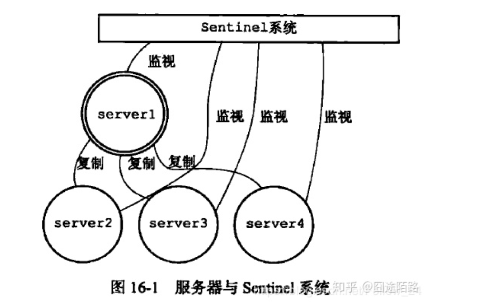

## 主从切换

主从切换技术的方法是：当主服务器宕机后，需要手动把一台从服务器切换为主服务器，这就需要人工干预，费事费力，还会造成一段时间内服务不可用。这不是一种推荐的方式，更多时候，我们优先考虑哨兵模式。

## 哨兵模式

哨兵模式是一种特殊的模式，首先Redis提供了哨兵的命令，哨兵是一个独立的进程，作为进程，它会独立运行。其原理是哨兵通过发送命令，等待Redis服务器响应，从而监控运行的多个Redis实例。



* 哨兵的作用：
    * 通过发送命令，让Redis服务器返回监控其运行状态，包括主服务器和从服务器。Sentinel会以每秒一次的频率向所有与它创建了命令连接的实例（主服务器、从服务器、其它Sentinel）发送ping命令，并通过相应的回复判断实例是否在线。
    * 当哨兵监测到master宕机，会自动将slave切换成master，然后通过发布订阅模式通知其他的从服务器，修改配置文件，让它们切换主机。

然而一个哨兵进程对Redis服务器进行监控，可能会出现问题，为此，我们可以使用多个哨兵进行监控。各个哨兵之间还会进行监控，这样就形成了多哨兵模式。

* 主观下线与客观下线

假设主服务器宕机，哨兵1先检测到这个结果，系统并不会马上进行failover过程，仅仅是哨兵1主观的认为主服务器不可用，这个现象成为主观下线。当后面的哨兵也检测到主服务器不可用，并且数量达到一定值时，当Sentinel从其它Sentinel那里接收到足够数量的已下线判断之后，Sentinel就会将从服务器判断为客观下线，并对主服务器执行故障转移。就会通过发布订阅模式，让各个哨兵把自己监控的从服务器实现切换主机。


* 客户端使用

客户端来连接集群时，会首先连接 sentinel，通过 sentinel 来查询主节点的地址，然后再去连接主节点进行数据交互。当主节点发生故障时，客户端会重新向 sentinel 要地址，sentinel 会将最新的主节点地址告诉客户端。

```
>>> from redis.sentinel import Sentinel
>>> sentinel = Sentinel([('localhost', 26379)], socket_timeout=0.1)
>>> sentinel.discover_master('mymaster')
('127.0.0.1', 6379)
>>> sentinel.discover_slaves('mymaster')
[('127.0.0.1', 6380)]
```

## 问题答疑

* 为什么至少需要3个sentinel

当指定时间内指定哨兵数量都认为主节点宕机则称为客观宕机。那指定数量是多少呢？这个指定数量实际上等于哨兵数量 / 2 + 1.也就是说如果哨兵数量等于2，出现一个哨兵宕机的情况，在需要主从切换的时候因为无法达到认为主节点宕机的哨兵数量为2，所以在主节点出现宕机时无法进行主从切换。所以说部署哨兵至少需要3个Sentinel实例来保证健壮性。

* 哨兵模式引发数据丢失问题

哨兵模式 + Redis主从复制这种部署结构，无法保证数据不会出现丢失。哨兵模式下数据丢失主要有两种情况：

  * 因为主从复制是异步操作，可能主从复制还没成功，主节点宕机了。这时候还没成功复制的数据就会丢失了。
  * 如果主节点无法与其他从节点连接，但是实际上还在运行。这时候哨兵会将一个从节点切换成新的主节点，但是在这个过程中实际上主节点还在运行，所以继续向这个主节点写入的数据会被丢失。

min-slaves-to-write 1  【保证至少一个从节点进行正常复制】
min-slaves-max-lag 10  【主从延迟最大时间】
使用这组命令可以设置至少有一个从节点数据复制延迟不能超过10S，也就是说如果一个直接点下所有从节点数据复制延迟都超过10S，则停止主节点继续接收处理新的请求。这样可以保证数据丢失最多只会丢失10S内的数据。

* redis sentinel定时任务

    * 每1秒每个sentintel节点对master节点和slave节点以及其余的sentinel节点执行ping操作【心跳检测】
    * 每x秒每个sentinel节点对master节点和slave节点执行info操作 【发现slave节点、确认主从关系】
    * 每2秒每个sentinel节点通过master节点的channel（sentinel:hello）master节点上有一个发布订阅的频道(__sentinel__:hello)。sentinel节点通过__sentinel__:hello频道进行信息交换(对节点的"看法"和自身的信息)，达成共识

## 相关链接

https://www.jianshu.com/p/06ab9daf921d