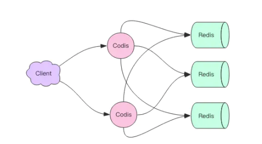
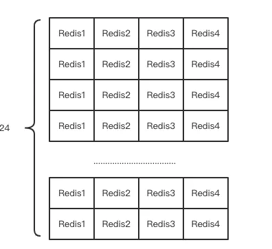

## 背景

* 单个实例内存往往都是受限的。其次体现在 CPU 的利用率上，单个 Redis 实例只能利用单个核心，这单个核心要完成海量数据的存取和管理工作压力会非常大。正是在这样的大数据高并发的需求之下，Redis 集群方案应运而生。它可以将众多小内存的 Redis 实例综合起来，将分布在多台机器上的众多 CPU 核心的计算能力聚集到一起，完成海量数据存储和高并发读写操作。

## Codis集群方案

* Codis 是 Redis 集群方案之一，Codis 使用 Go 语言开发，它是一个代理中间件，它和 Redis 一样也使用 Redis 协议对外提供服务，当客户端向 Codis 发送指令时，Codis 负责将指令转发到后面的 Redis 实例来执行，并将返回结果再转回给客户端。
  * Codis 上挂接的所有 Redis 实例构成一个 Redis 集群，当集群空间不足时，可以通过动态增加 Redis 实例来实现扩容需求。
  * 客户端操纵 Codis 同操纵 Redis 几乎没有区别，还是可以使用相同的客户端 SDK，不需要任何变化。
  * 因为 Codis 是无状态的，它只是一个转发代理中间件，这意味着我们可以启动多个 Codis 实例，供客户端使用，每个 Codis 节点都是对等的。因为单个 Codis 代理能支撑的 QPS 比较有限，通过启动多个 Codis 代理可以显著增加整体的 QPS 需求，还能起到容灾功能，挂掉一个 Codis 代理没关系，还有很多 Codis 代理可以继续服务。




## Codis 分片原理

* codis 将所有的 key 默认划分为 1024 个槽位(slot)，它首先对客户端传过来的 key 进行 crc32 运算计算哈希值，再将 hash 后的整数值对 1024 这个整数进行取模得到一个余数，这个余数就是对应 key 的槽位。每个槽位都会唯一映射到后面的多个 Redis 实例之一，Codis 会在内存维护槽位和 Redis 实例的映射关系。这样有了上面 key 对应的槽位，那么它应该转发到哪个 Redis 实例就很明确了。



```
hash = crc32(command.key)
slot_index = hash % 1024
redis = slots[slot_index].redis
redis.do(command)
```

* 不同的 Codis 实例之间槽位关系如何同步？

如果 Codis 的槽位映射关系只存储在内存里，那么不同的 Codis 实例之间的槽位关系就无法得到同步。所以 Codis 还需要一个分布式配置存储数据库专门用来持久化槽位关系。Codis 将槽位关系存储在 zk 中，并且提供了一个 Dashboard 可以用来观察和修改槽位关系，当槽位关系变化时，Codis Proxy 会监听到变化并重新同步槽位关系，从而实现多个Codis Proxy 之间共享相同的槽位关系配置。


* 扩容：刚开始 Codis 后端只有一个 Redis 实例，1024 个槽位全部指向同一个 Redis。然后一个 Redis 实例内存不够了，所以又加了一个 Redis 实例。这时候需要对槽位关系进行调整，将一半的槽位划分到新的节点。这意味着需要对这一半的槽位对应的所有 key 进行迁移，迁移到新的 Redis 实例。
  * Codis 如何找到槽位对应的所有 key 呢？Codis 对 Redis 进行了改造，增加了 SLOTSSCAN 指令，可以遍历指定 slot 下所有的 key。Codis 通过 SLOTSSCAN 扫描出待迁移槽位的所有的 key，然后挨个迁移每个 key 到新的 Redis 节点。
  * 在迁移过程中，Codis 还是会接收到新的请求打在当前正在迁移的槽位上，因为当前槽位的数据同时存在于新旧两个槽位中，Codis 如何判断该将请求转发到后面的哪个具体实例呢？Codis 无法判定迁移过程中的 key 究竟在哪个实例中，所以它采用了另一种完全不同的思路。当 Codis 接收到位于正在迁移槽位中的 key 后，会立即强制对当前的单个 key 进行迁移，迁移完成后，再将请求转发到新的 Redis 实例。
```
slot_index = crc32(command.key) % 1024
if slot_index in migrating_slots:
    do_migrate_key(command.key) # 强制执行迁移
    redis = slots[slot_index].new_redis
else:
    redis = slots[slot_index].redis
    redis.do(command)
```

* 自动均衡:Redis 新增实例，手工均衡 slots 太繁琐，所以 Codis 提供了自动均衡功能。自动均衡会在系统比较空闲的时候观察每个 Redis 实例对应的 Slots 数量，如果不平衡，就会自动进行迁移。


## Codis代价

* 功能受限：不支持事务，不支持rename
* 单个 key 对应的 value 不宜过大:因为集群的迁移的最小单位是key，对于一个 hash 结构，它会一次性使用 hgetall 拉取所有的内容，然后使用 hmset 放置到另一个节点。如果 hash 内部的 kv 太多，可能会带来迁移卡顿。官方建议单个集合结构的总字节容量不要超过 1M。如果我们要放置社交关系数据，例如粉丝列表这种，就需要注意了，可以考虑分桶存储，在业务上作折中。
* 性能不如原生Redis:Codis 因为增加了 Proxy 作为中转层，所有在网络开销上要比单个 Redis 大，毕竟数据包多走了一个网络节点，整体在性能上要比单个 Redis 的性能有所下降。但是这部分性能损耗不是太明显，可以通过增加 Proxy 的数量来弥补性能上的不足。Codis 的集群配置中心使用 zk 来实现，意味着在部署上增加了 zk 运维的代价，不过大部分互联网企业内部都有 zk 集群，可以使用现有的 zk 集群使用即可。

## MGET案例

mget 指令用于批量获取多个 key 的值，这些 key 可能会分布在多个 Redis 实例中。Codis 的策略是将 key 按照所分配的实例打散分组，然后依次对每个实例调用 mget 方法，最后将结果汇总为一个，再返回给客户端。

## Codis后台管理

后台管理的界面非常友好，使用了最新的 BootStrap 前端框架。比较酷炫的是可以看到实时的 QPS 波动曲线。同时还支持服务器集群管理功能，可以增加分组、增加节点、执行自动均衡等指令，还可以直接查看所有 slot 的状态，每个 slot 被分配到哪个 Redis 实例。
