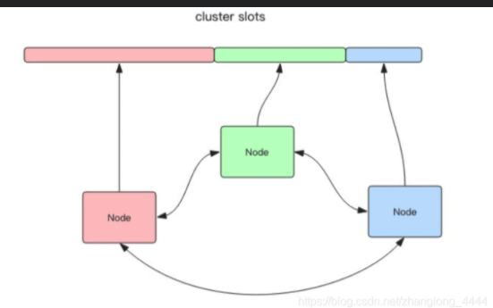
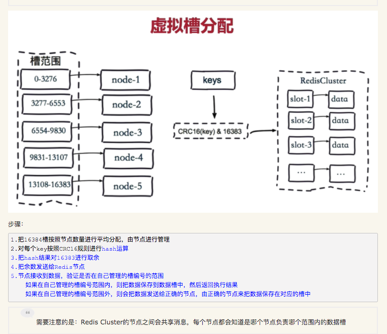
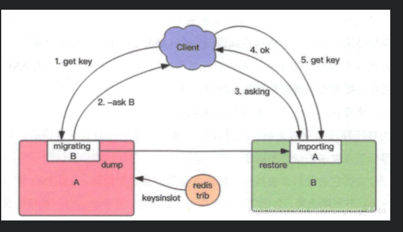

** RedisCluster介绍

RedisCluster 是 Redis 的亲儿子，它是 Redis 作者自己提供的 Redis 集群化方案。相对于 Codis 的不同，它是去中心化的如图所示，该集群有三个 Redis 节点 组成，每个节点负责整个集群的一部分数据。



Redis Cluster 将所有数据划分为 16384 的 slots，它比 Codis 的 1024 个槽划 分的更为精细，每个节点负责其中一部分槽位。槽位的信息存储于每个节点中， 它不像 Codis，它不需要另外的分布式存储来存储节点槽位信息。



直接定位出槽位配置信息：当 Redis Cluster 的客户端来连接集群时，它也会得到一份集群的槽位配置信 息。这样当客户端要查找某个 key 时，可以直接定位到目标节点。Codis 需要通过 Proxy 来定位目标节点，RedisCluster 是 直接定位。客户端为了可以直接定位某个具体的 key 所在的节点，它就需要缓存槽位相关信息，这样才可以准确快速地定位到相应的节点。同时因为槽位的信息可能会存在客户端与服务器不一致的情况，还需要纠正机制来实现槽位信息的校验调整。

** 槽位定位算法

* 过程：当 Redis Cluster 的客户端来连接集群时，它也会得到一份集群的槽位配置信 息。这样当客户端要查找某个 key 时，可以直接定位到目标节点。
* 定位错误：当客户端向一个错误的节点发出了指令，该节点会发现指令的 key 所在的槽位并 不归自己管理，这时它会向客户端发送一个特殊的跳转指令携带目标操作的节点 地址，告诉客户端去连这个节点去获取数据。
```
GET x
-MOVED 3999 127.0.0.1:6381
```
MOVED 指令的第一个参数 3999 是 key 对应的槽位编号，后面是目标节点地址。MOVED 指令前面有一个减号，表示该指令是一个错误消息。
客户端收到 MOVED 指令后，要立即纠正本地的槽位映射表。后续所有 key 将使用新的槽位映射表。

** 迁移

* redis Cluster 提供了工具 redis-trib 可以让运维人员手动调整槽位的分配情况，它使用 Ruby 语言进行开发，通过组合各种原生的 Redis Cluster 指令来实现。这点 Codis 做的更加人性化，它不但提供了 UI 界面可以让我们方便的迁移，还提供了自动化平衡槽位工具。

* Redis 迁移的单位是槽，Redis 一个槽一个槽进行迁移，当一个槽正在迁移时， 这个槽就处于中间过渡状态。这个槽在原节点的状态为 migrating ，在目标节点 的状态为 importing ，表示数据正在从源流向目标。
  * 具体过程：迁移工具 redis-trib 首先会在源和目标节点设置好中间过渡状态，然后一次性获取源节点槽位的所有 key 列表(keysinslot指令，可以部分获取)，再挨个key进 行迁移。每个 key 的迁移过程是以原节点作为目标节点的「客户端」，原节点对当前的key执行dump指令得到序列化内容，然后通过「客户端」向目标节点发 送指令restore携带序列化的内容作为参数，目标节点再进行反序列化就可以将 内容恢复到目标节点的内存中，然后返回「客户端」OK，原节点「客户端」收 到后再把当前节点的key删除掉就完成了单个key迁移的整个过程。
  * 总结：设置好过渡状态，一次性获取槽位的所有key,逐个迁移key,源节点序列化key然后发给目标节点，目标节点返回Ok再删除key。从源节点获取内容 => 存到目标节点 => 从源节点删除内容。
  * 备注：迁移过程是同步的，在目标节点执行restore指令到原节点删除key之间，原节点的主线程会处于阻塞状态，直到key被成功删除。如果迁移过程中突然出现网络故障，整个slot的迁移只进行了一半。这时两个节 点依旧处于中间过渡状态。待下次迁移工具重新连上时，会提示用户继续进行迁移。如果key的内容很大，因为migrate指令是阻塞指 令会同时导致原节点和目标节点卡顿，影响集群的稳定型。所以在集群环境下业务逻辑要尽可能避免大key的产生。

* 迁移过程中的数据访问流程：首先新旧两个节点对应的槽位都存在部分 key 数据。客户端先尝试访问旧节点， 如果对应的数据还在旧节点里面，那么旧节点正常处理。如果对应的数据不在旧 节点里面，那么有两种可能，要么该数据在新节点里，要么根本就不存在。旧节 点不知道是哪种情况，所以它会向客户端返回一个 -ASK targetNodeAddr 的重定向指令。客户端收到这个重定向指令后，先去目标节点执行一个不带任何参数的asking 指令，然后在目标节点再重新执行原先的操作指令。



* 为什么需要执行一个不带参数的 asking 指令呢?

因为在迁移没有完成之前，按理说这个槽位还是不归新节点管理的，如果这个时候向目标节点发送该槽位的指令，节点是不认的，它会向客户端返回一个 - MOVED 重定向指令告诉它去源节点去执行。如此就会形成重定向循环。asking 指令的目标就是打开目标节点的选项，告诉它下一条指令不能不理，而要当成自己的槽位来处理。从以上过程可以看出，迁移是会影响服务效率的，同样的指令在正常情况下一个 ttl 就能完成，而在迁移中得 3 个 ttl 才能搞定。


* 槽位感知：如果 Cluster 中某个槽位正在迁移或者已经迁移完了，client 如何能感知到槽位 的变化呢?

客户端保存了槽位和节点的映射关系表，它需要即时得到更新，才可 以正常地将某条指令发到正确的节点中。

我们前面提到 Cluster 有两个特殊的 error 指令，一个是 moved ，一个是 asking 。

    *第一个 moved 是用来纠正槽位的。如果我们将指令发送到了错误的节点，该节 点发现对应的指令槽位不归自己管理，就会将目前节点的地址随同 moved 指令 回复给客户端通知客户端去目标节点去访问。这个时候客户端就会刷新自己的槽位关系表，然后重试指令，后续所有打在该槽位的指令都会转到目标节点。

    *第二个 asking 指令和 moved 不一样，它是用来临时纠正槽位的。如果当前槽位正处于迁移中，指令会先被发送到槽位所在的旧节点，如果旧节点存在数据， 那就直接返回结果了，如果不存在，那么它可能真的不存在也可能在迁移目标节 点上。所以旧节点会通知客户端去新节点尝试一下拿数据，看看新节点有没有。 这时候就会给客户端返回一个asking error 携带上目标节点的地址。客户端收 到这个 asking error 后，就会去目标节点去尝试。客户端不会刷新槽位映射关 系表，因为它只是临时纠正该指令的槽位信息，不影响后续指令。