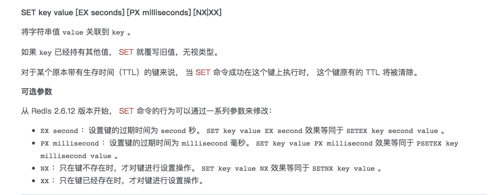

## 分布式锁

分布式锁本质上要实现的目标就是在 Redis 里面占一个“茅坑”，当别的进程也要来占时，发现已经有人蹲在那里了，就只好放弃或者稍后再试。占坑一般是使用 setnx(set if not exists) 指令，只允许被一个客户端占坑。先来先占，用完了，再调用 del 指令释放茅坑。

```
 SETNX KEY_NAME VALUE
 Redis Setnx（SET if Not eXists） 命令在指定的 key 不存在时，为 key 设置指定的值。
 设置成功，返回 1 。 设置失败，返回 0 。
```

* 异常case:但是有个问题，如果逻辑执行到中间出现异常了，可能会导致 del 指令没有被调用，这样就会陷入死锁，锁永远得不到释放。因此需要给锁加上一个过期时间，比如 5s，这样即使中间出现异常也可以保证 5 秒之后锁会自动释放。

## 2.8版本以后的分布式锁

为了治理这个乱象，Redis 2.8 版本中作者加入了 set 指令的扩展参数，使得 setnx 和 expire 指令可以一起执行，彻底解决了分布式锁的乱象。从此以后所有的第三方分布式锁 library 可以休息了。
set lock:codehole true ex 5 nx
上面这个指令就是 setnx 和 expire 组合在一起的原子指令，它就是分布式锁的奥义所在.



## lua脚本保证原子性？？？


